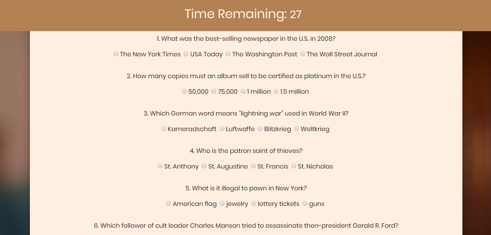

# TriviaGame

# Project Description

Trivia Game is a trivia game of general knowledge. There are 10 questions. The user has 60 seconds to answer the questions. If the user finishes early, there is a Done button that can be clicked to end the game. When the game ends, the user is shown the total number of questions answered correctly, incorrectly, as well as the total number of questions unanswered. At this point, the user can play again by clicking the Play Again button. The user is then taken back to the same ten questions. All of the answers are cleared so that the user can start answering the questions from scratch. The total scores will also reset to zero. The user may also decide to quit the game by clicking on the Quit button. Upon clicking Quit, a modal appears on the screen. The user can click Close to close the modal, or the user can click on Goodbye. As an added feature, if the user clicks on Goodbye, the user is directed to another page with a full-screen animated message saying, "Goodbye".

This project uses jQuery and Javascript, as well as HTML and CSS, including Bootstrap. The font used ("Poppins") comes from Google Fonts. The favicon used on the tab is from Font Awesome. The background image comes from https://www.pexels.com/. The code from the animated "goodbye" page has been adapted from https://codepen.io/Chokcoco/pen/jLjNRj.

# Technologies Used

* jQuery
* JavaScript
* Bootstrap
* CSS
* HTML

# Trivia Game Live Link

Please check out the live link for GifTastic here:

https://answebdev.github.io/TriviaGame/

# Screenshots

